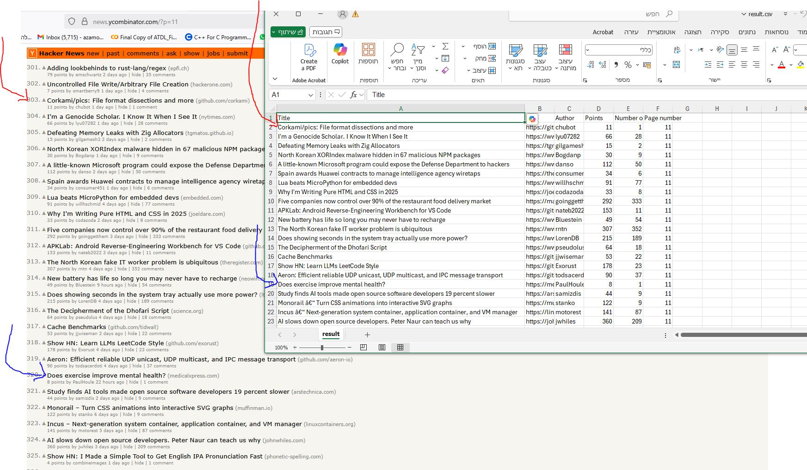

# Harvester

A Python-based web scraper for extracting post data from Hacker News (https://news.ycombinator.com/) into a CSV.

## Requirements

- Python 3.10+
- pip (Python package manager)

## Installation

1. **Clone or download the project:**

   ```bash
   git clone https://github.com/azamos/harvester
   cd harvester
   ```

2. **Create a virtual environment:**

   ```bash
   python -m venv venv
   ```

3. **Activate the virtual environment:**

   **On Windows:**

   ```bash
   venv\Scripts\activate
   ```

   **On macOS/Linux:**

   ```bash
   source venv/bin/activate
   ```

4. **Install dependencies:**
   ```bash
   pip install -r requirements.txt
   ```

## Usage

> **Note:** Currently tested on Windows Command Prompt, but should work on macOS and Linux as well. The application supports both online mode (fetching from web) and offline mode (using locally stored pages for development/testing).

> **Development Note:** Use the `--offline` flag to test with locally stored HTML pages instead of fetching from the web. This is useful for development and testing purposes.

### Basic Command Structure

```bash
python -m src.main --num_post NUM_POST --min_score MIN_SCORE --max_score MAX_SCORE --list_string LIST_STRING [--offline] [--debug]
```

### Parameters

- `--num_post`: Number of posts to process (positive integer, max 900)
- `--min_score`: Minimum score threshold (non-negative integer)
- `--max_score`: Maximum score threshold (non-negative integer, must be >= min_score)
- `--list_string`: Comma-separated list of positive integers (duplicates allowed)
  - No spaces: `1,2,3`
  - With spaces: `"1, 2, 3"` (quotes required)
- `--offline`: Use locally stored pages instead of fetching from web (optional)
- `--debug`: Enable debug output (optional)

### Example Usage

```bash
# Online mode (default) - fetches from web
python -m src.main --num_post 50 --min_score 0 --max_score 1000 --list_string 1,2,3

# Offline mode - uses locally stored pages
python -m src.main --num_post 50 --min_score 0 --max_score 1000 --list_string 1,2,3 --offline

# With spaces in list_string (quotes required)
python -m src.main --num_post 50 --min_score 0 --max_score 1000 --list_string "1, 2, 3"
```

### Debug Mode

To view debug output, add the `--debug` flag:

```bash
# Online mode with debug
python -m src.main --num_post 50 --min_score 0 --max_score 1000 --list_string 1,2,3 --debug

# Offline mode with debug
python -m src.main --num_post 50 --min_score 0 --max_score 1000 --list_string 1,2,3 --offline --debug
```

## Dependencies

- `requests` - For making HTTP requests
- `beautifulsoup4` - For HTML parsing
- `pytest` - For unit testing

## Running Tests

To run the test suite:

```bash
pytest -v
```

## Sample Output

### CSV Output Example

A sample CSV output file is available at [`sampleOutput/result.csv`](sampleOutput/result.csv).

This sample was generated using the following command:

```bash
python -m src.main --num_post 100 --min_score 0 --max_score 200000 --list_string 5,10-4,1-3 --debug
```

### Visual Comparison

Below is a screenshot comparing the original Hacker News page and the extracted CSV output:



## Future Improvements

- Adding a `--force` flag to override the num_post built-in limit of 900
